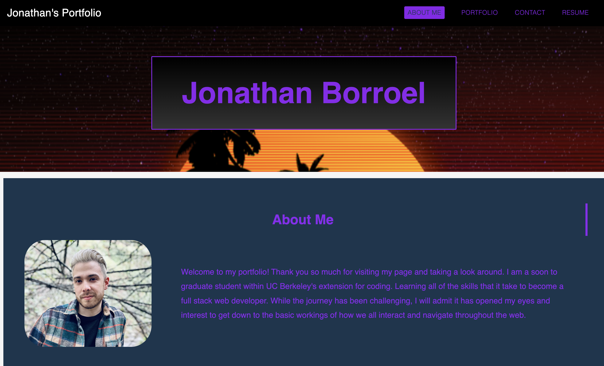

# Updated React Portfolio


## Links

[JATE deployed site](https://fierce-refuge-54485.herokuapp.com)

## Table of Contents

* [Description](#description)
* [Installation](#installation)
* [Code Example](#code-example)
* [Application Examples](#application-examples)
* [Usage](#usage)
* [License](#license)
* [Questions](#questions)


## Description
This is update to my original personal html made portfolio. This new update incorporates react to help render the pages and with the help of a newly discovered technology, was able to incorporate Mui for react to style the pages. 

## Installation
No installation required, simply visit the repo link above.

## Code Example
Below is an example of code to help render an Icon used with Mui for react
```JS
// Mui being used to create the IconButton with added styling
    <Box posistion="fixed">
      <AppBar component="Navbar">
        <Toolbar sx={{ backgroundColor: "black" }}>
          <IconButton
            onClick={drawerEl}
            sx={{ color: "rgba(150, 38, 254, 0.928)", display: { md: "none" } }}
          >
            <MenuIcon sx={{ fontSize: 45 }} />
          </IconButton>
```

## Application Examples
Bellow is an example of the application running within the deployed link



---


## Usage


Make sure you have followed the deployed link within the [links](#links) section. After following the deployed link, the user will be greeted with the newly rendered react portfolio. The user can then navigate to different pages on the site with options of visiting the portfolio, contact, and resume section. Withing the portfolio section alone holds additional links to previous projects where the user can either click the image and be led to the deployed project, or click the links below the image to be sent to the repo.


## License
For additional information on this license please use the provided link


[MIT License](https://choosealicense.com/licenses/mit/)

## Questions
Please refer any questions to my Github

Github: [jonnyboy808](https://github.com/jonnyboy808)


